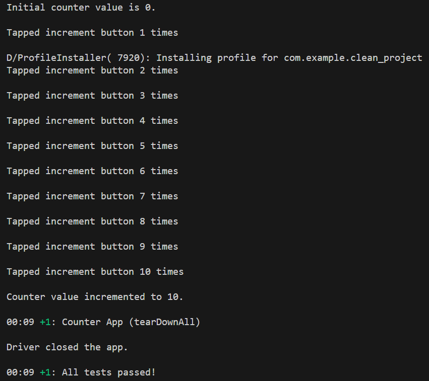

# Flutter Driver Automation Setup

This repository is for me documenting my learning journey on automating end-to-end testing of a Flutter app using Flutter Driver.

## Prerequisites

- Flutter SDK installed (v3.0.0 or later).
- Android Studio or VS Code for development. (I prefer to use VS Code for development)
- A connected physical device or emulator.

## Setup

1. Clone the repository:
   ```sh
   git clone https://github.com/frostytm90/flutter-automation-journey.git
   cd <flutter-automation-journey>
   ```

2. Install dependencies by running:
   ```sh
   flutter pub get
   ```

3. Add the `flutter_driver` dependency to `pubspec.yaml` under `dev_dependencies`:
   ```yaml
   dev_dependencies:
     flutter_driver:
       sdk: flutter
     test: any
   ```

## Writing My First Test

1. Create a `test_driver` directory in the root project.
2. Add a test file, for example `auto_1.dart`:

   ```dart
   import 'package:flutter_driver/flutter_driver.dart';
   import 'package:test/test.dart';
   import 'dart:async'; // For adding delays

   void main() {
     group('Counter App', () {
       FlutterDriver? driver;

       setUpAll(() async {
         driver = await FlutterDriver.connect();
         print('Driver connected to app.');
       });

       tearDownAll(() async {
         if (driver != null) {
           await driver!.close();
           print('Driver closed the app.');
         }
       });

       test('increment button pressed 10 times', () async {
         final counterTextFinder = find.byValueKey('counter');
         final incrementButtonFinder = find.byValueKey('increment');

         // Adding a log and delay to observe the initial value
         print('Checking initial counter value...');
         await Future.delayed(Duration(seconds: 1));
         expect(await driver!.getText(counterTextFinder), "0");
         print('Initial counter value is 0.');

         // Press the increment button 100 times
         for (int i = 0; i < 10; i++) {
           await driver!.tap(incrementButtonFinder);
           print('Tapped increment button ${i + 1} times');
           await Future.delayed(Duration(milliseconds: 100)); // Short delay to ensure the button press is registered
         }

         // Adding a log and delay to observe the final value
         await Future.delayed(Duration(seconds: 2));
         expect(await driver!.getText(counterTextFinder), "10");
         print('Counter value incremented to 10.');
       });
     });
   }
   ```

## Running the Tests

Run the tests using the following command:

```sh
flutter drive --target=lib/main.dart --driver=test_driver/app_test.dart
```
I saw the results as this which is what I expected.


## Troubleshooting

I went into an error here where on my first few runs, I didn't check if my physical device is connected

- **No Connected Device**: Ensure the emulator or physical device is properly connected and recognized:
  ```sh
  flutter devices
  ```

- **Flutter Driver Connection Timeout**: This may occur if the app takes too long to launch. Make sure your app runs smoothly before starting the tests.

- **Tests Running Too Fast**: If actions are happening too fast to observe, add delays using `await Future.delayed(Duration(seconds: n));`.

